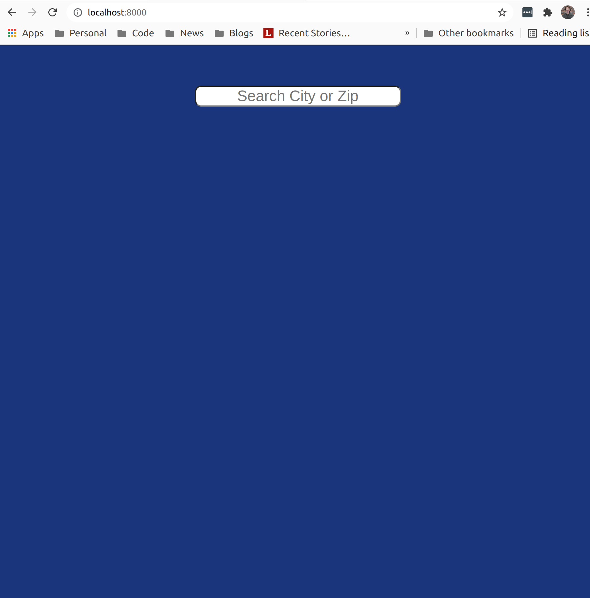

# Weather App

## Demo



## Setup

Install dependencies

```
yarn install
```

Get an [OpenWeather API key](https://home.openweathermap.org/users/sign_up) and
add it to your .env

```
cp .env.template .env
```

## Run

Start the server (`yarn server:start`)
and then navigate to [http://localhost:8000](http://localhost:8000)

## Development

While making changes to the client side React code, you will need to run `yarn
client:build` or stop and start the server with `yarn server:start` in order for
your changes to be picked up.

## Available Scripts

In the project directory, you can run:

### `yarn server:start`

Runs the server.

### `yarn server:test`

Runs the server tests.

### `yarn client:build`

Builds the app for production to the `build` folder.\
It correctly bundles React in production mode and optimizes the build for the best performance.

The build is minified and the filenames include the hashes.\
Your app is ready to be deployed!

See the section about [deployment](https://facebook.github.io/create-react-app/docs/deployment) for more information.
